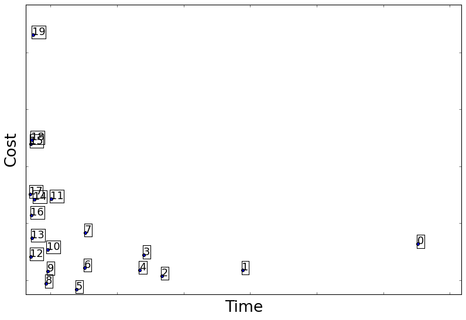
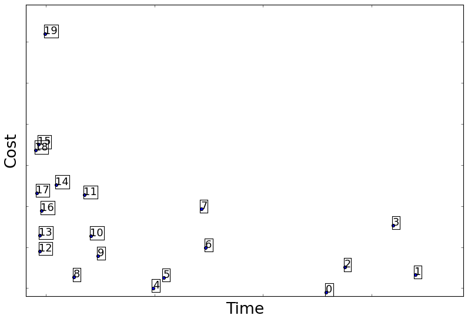
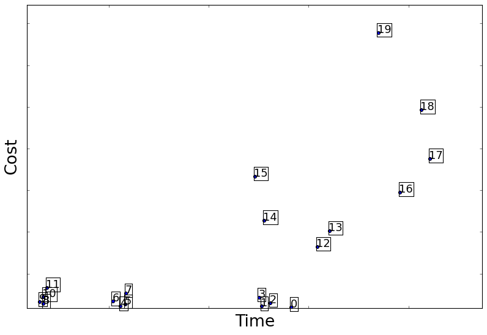
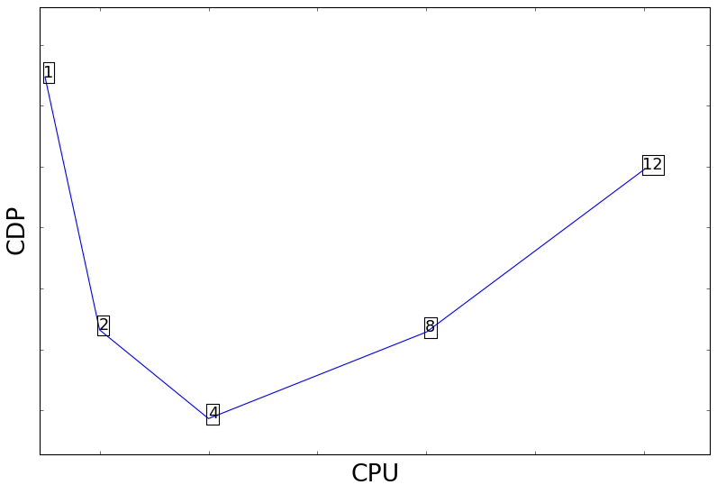
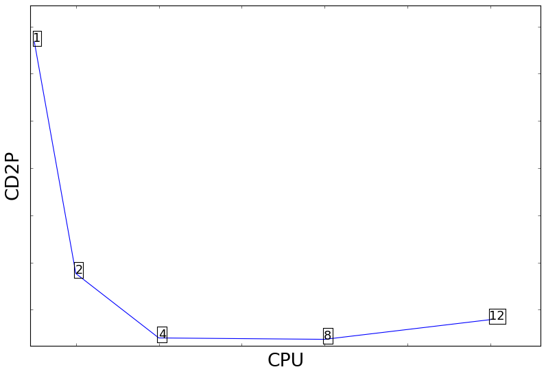
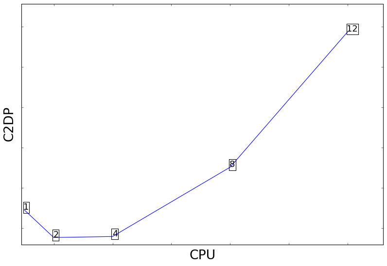

# Exporing the Time-Cost Trade-Off in Large-Scale Data-Intensive Computing on the Cloud

### 1. Introduction

* Cloud computing (IaaS) is preferrable than traditional computing for running data-intensive applications (time and cost objective/constraints can vary over time)
  * Cloud computing shift costs from capital expenditure to operational expense — Pay-as-you-go model
  * Cluster configuration is made on each run of each application, e.g., batch processing routine
  * On the other hand, traditional computing lacks flexibility (total capacity is fixed and determined  at purchase) to choose cluster configuration, i.e. **node type and number**
  * Therefore, this additional flexibiility can and should be leveraged
  * In particular, when minimum time is not an absolute, then cost becomes a primary factor in optimization
* IaaS allows one to trade time for cost, and vice versa
  * Objectives (time and cost) define which configuration to select from all
    * Fastest: minimize time regardless of cost (this doesn't exist in real world)
    * Cheapest: minimize cost regardless of time (this doesn't exist in real world)
    * Deadline: minimize cost within deadline
  * Time-cost tradeoff: willing to trade some amount of time (slowdown) for a cost savings
* The cost-time trade-off is not yet fully explored; mis-configurations can lead to higher resource costs or longer execution time
  - Poor configuration increases cost by 2-3 times on average and 12 times in the worst case [CherryPick]
  - Least-squares solver (a key component in machine learning) shows 1.9 times slow down for different configurations at the same costs, and matrix multiplication shows similar results [Ernest]
  - PageRank shows at least 10 times cost for different configurations with similar elapsed time (our evaluation)
  - Web Log Analysis shows 4 times slow down with different configurations with similiar costs (our evaluation)
* However, choosing the *best* configurations is not straight-forward
  - Non-linear relationship between performance and resource capability (related to cost) [CherryPick]
    - Diminishing return when memory size goes beyond a certain amount (for certain applications)
  - Cost model is not monotonically inceasing or decreasing wrt. cluster size (related to cost) [CherryPick]
    - Expanding cluster size accelerates computation but also increases price per unit of time
  - Application characteristics are very different
    - Terasort on MapReduce is CPU bound and regression on Spark is memory bound
    - Therefore, their trade-offs are also different

* - Analytical modeling is difficult
    - Requires knowledge about the application characteristics, software configurations and system architecture
    - Need to support diverse applications
  - Exhaustive search is not feasible because configuration space is verly large and evaluation of configurations is very expensive
    - The total number of supported instance types and sizes is large (>100)
    - The cluster size can be arbitrarily large (1 to 100+)

* In this work, we aim to find out the most cost-effective configurations, given time and cost constraints.  This approach needs to be effective (locating the *best* configurations) and cheap (requiring less evaluation costs).

* First, we argue that **cost-delay product (CDP)** is a straightforward way to define the tradeoff

* CDP - time equal to cost: 5% slowdown/5% savings (1.05:0.95) same as (1:1)
  * CD^2P - time more critical than cost (1.05:0.91) same as (1:1)
  * C^2DP - cost more critical than time (1.05:0.91) same as (1:1)
  * There is no absolute minimum time (or cost): if 1% faster cost 50% probably will choose slightly slower configuration.

* In the future work, we plan to design an configuration recommendation engine

  * Use low-level performance metrcis as expert knowledge
  * Efficient search algorithms that leverage export knowledge

### 2. Cost-Delay Product Trade-Offs

* Define CDP
  * ​
  * Similar to EDP
  * Justification
* Time vs. Cost Trade-offs
  * Summary
    * It is not obvious to choose a configuration
    * Applications have different trade-off curves
  * PageRank 
  * Web Log Analysis  
  * Regression 
* CDP (Cost-Delay Product)
  * Cost and time are equal important
  * RageRank (4GB per CPU) 
* CD2P (Cost-Delay-Squared Product)
  * Time is more important
  * RageRank (4GB per CPU) 
* C2DP (Cost-Squared-Delay Product)
  * Cost is more important
  * RageRank (4GB per CPU) 

### 3. Towards Efficient Recommendation of Resource Configurations

#### 3.1 Configuration Space

* Show the wide range of AWS configurations

#### 3.2 Low-Level Performance Metrics

- β: CPU bound
- MPO: memory bound
- Inside-Out shows low-level performance metrics are a good proxy for measuring end-to-end performance of a distributed storage systems

#### 3.3 Data-Driven Modeling Approach

* Regression-based Approach
* Classification Approach
  * Behavior pattern
  * Anamoly detection
* Deep Learning

#### 3.4 Search Optimization

* Random Search
* Coordinate Descent
  * May face local minimum or maximum
* Evolutionary Algorithm (EA)
* Bayesian Optimization (BO) 

#### 3.5 Guided Search with Expert Knowledge

- Previous search algorithms focus on hyperparameters or solely configurations.  We argue that the search algorithms can be augmented by leveing low-level system performance metrics.
- Our approach leverage Bayesian Optimization and expert's knowledge
  - Bayesian optimization to reduce evaluation cost [CherryPick]
  - Expert's strategy (low-level performance metrcis) [FABOLAS, Inside-Out]
    - (Saturated resources) Limiting factors needs to be identified
    - (Unsaturated resources) are not that important
    - CDP inforation for knowing the trade-off (exploration or exploitation)

### 4. Related Work

- Characterizing application
  - Analyzing the energy-time trade-off in high-performance computing applications
  - Dynamically Controlling Node-Level Parallelism in Hadoop
- Data-Driven Performance Modeling
  - Model Building
    - Inside-out
- Configuration Recommendation
  - Parameter Tuning
    - Selfish
    - Dynamically Controlling Node-Level Parallelism in Hadoop
  - Storage configurations
  - Cloud configurations
    - Earnest
    - Cherrypick
- Search Algorithms
  - Random Search
  - Coordinate Descent
  - Genetic Algorithm
  - Bayesian Optimization

### 5. Conclusion